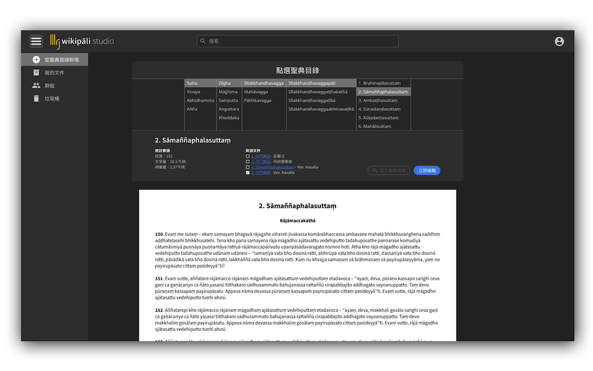
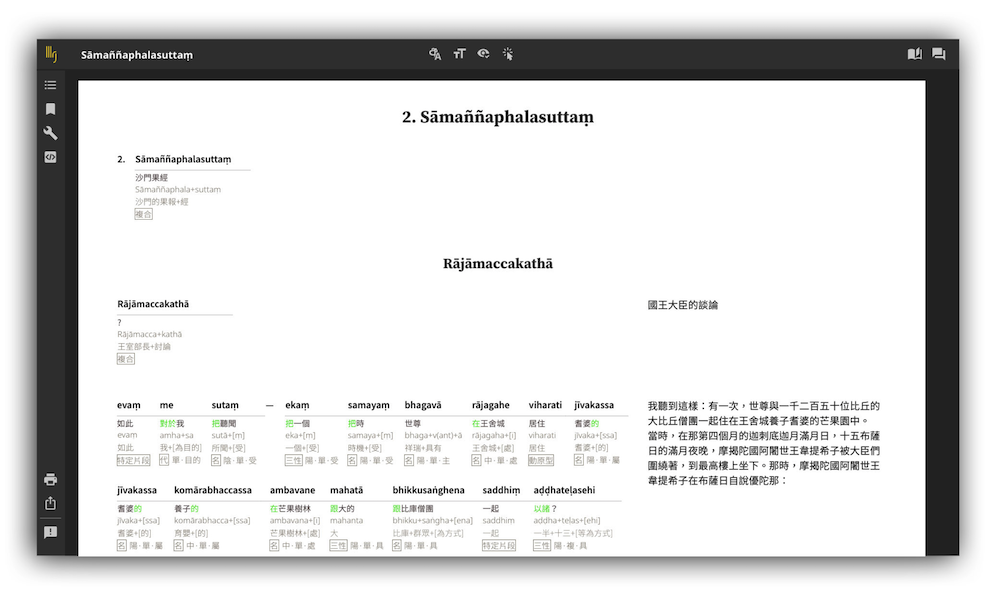

## Table of Contents

1. [Overview](#overview)
2. [Role](#role)
3. [Problem](#problem)
4. [Goal](#goal)
5. [Solution](#solution)

---

## Overview

Wikipāli 是一個以佛教巴利語聖典為核心的國際協作翻譯平台。該專案是由我在斯里蘭卡學習冥想期間，與兩位夥伴共同發起，旨在整合全球資源，建立一個線上與線下結合的高效翻譯系統，為推動聖典的現代化與普及化做出貢獻。

---

## 👨‍💻 Role

### Design Director / Front-End Developer

- IAPT 國際巴利三藏學院 視覺統籌
- wikipāli 翻譯平台 UI 設計
- wikipāli 前端開發

---

## ❓ Problem

Many individuals face difficulty in:

1. 巴利語佛教經典缺乏完整且符合現代語言邏輯的中文翻譯，影響學術研究與普羅大眾的理解。
2. 傳統翻譯方式效率低，國際翻譯團隊缺乏協作平台。
3. 現有翻譯成果無法快速分享與應用，知識傳播受限。

---

## 🎯 Goal

1. 建立一個多語種佛教經典的線上協作翻譯平台，提升翻譯效率。
2. 打造全球翻譯團隊的溝通橋樑，促進資源整合與合作。
3. 推廣上座部佛教文化，讓經典內容更易於大眾和研究者理解與應用。

---

## ✨ Solution

- 開發一個用於翻譯和協作的線上平台，整合工具如即時翻譯、版本控制和團隊協作功能。
- 成功組織多國團隊，完成多篇巴利語經典的中文翻譯，並定期更新至平台。
- 平台上線後，吸引來自美國、緬甸、中國等地的專業團體參與翻譯，擴大影響力。

---
